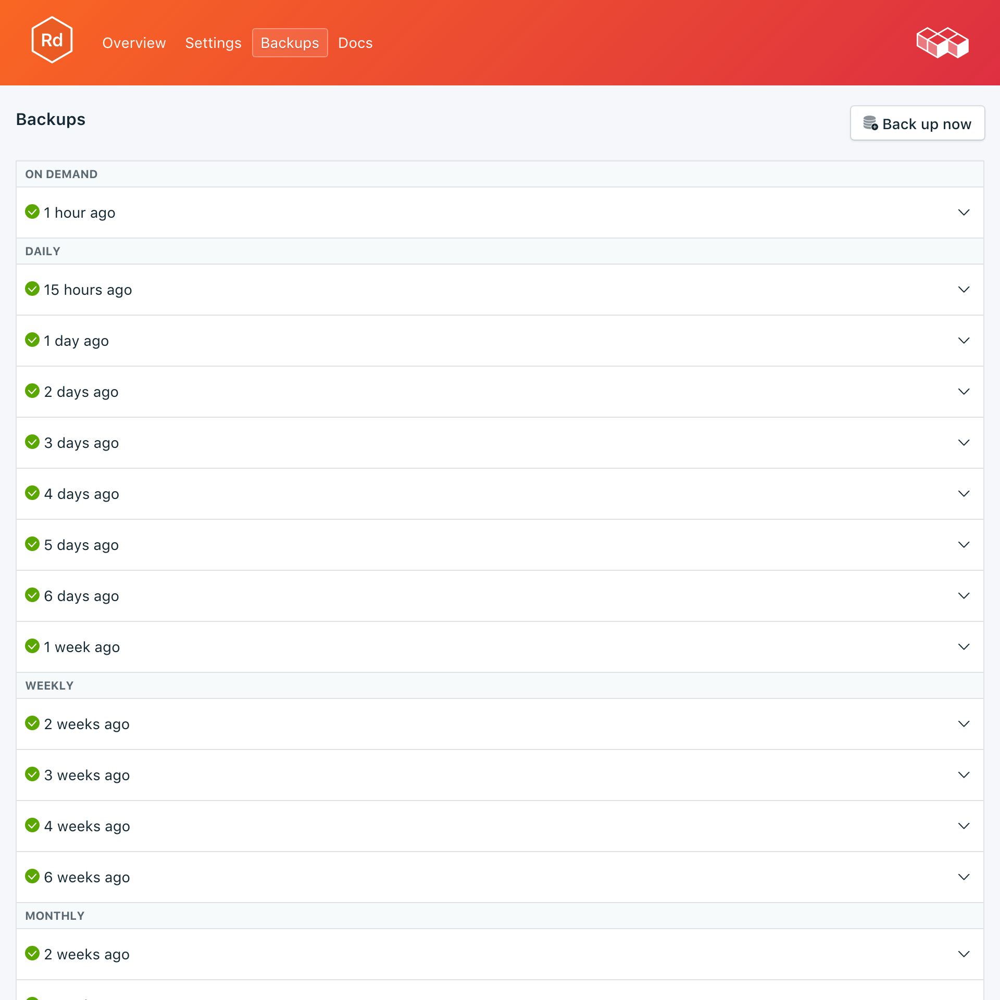
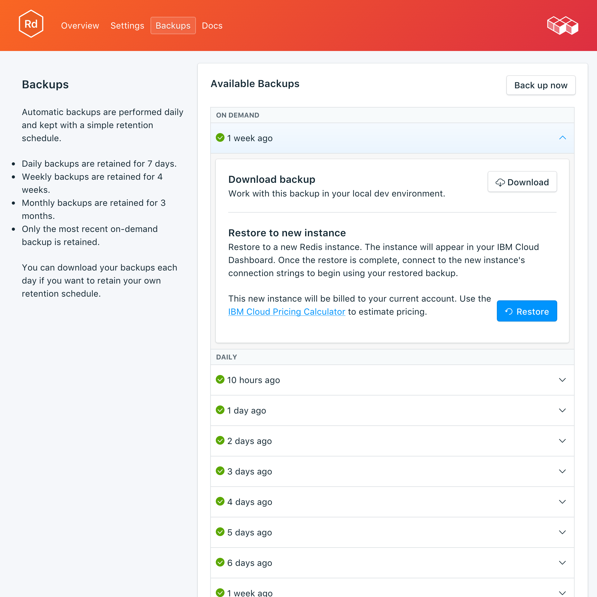

---

copyright:
  years: 2017,2018
lastupdated: "2018-03-02"
---

{:new_window: target="_blank"}
{:shortdesc: .shortdesc}
{:screen: .screen}
{:codeblock: .codeblock}
{:pre: .pre}

# Backups
{: #backups}

You can create and download backups from the _Backups_ tab of the _Manage_ page of your service dashboard. Daily, weekly, monthly, and on-demand backups are available. They are retained according to the following schedule:

Backup type|Retention schedule
----------|-----------
Daily|Daily backups are retained for 7 days
Weekly|Weekly backups are retained for 4 weeks
Monthly|Monthly backups are retained for 3 months
On-demand|One on-demand backup is retained. The retained backup is always the most recent on-demand backup.
{: caption="Table 1. Backup retention schedule" caption-side="top"}

Backup schedules and retention policies are fixed. If you need to keep more backups than the retention schedule allows, you should download backups and retain archives according to your business requirements.

## Viewing existing backups

Daily backups of your database are automatically scheduled. To view your existing backups, navigate to the *Manage* page of your service dashboard. 

  

Click on the corresponding row to expand the options for any available backup.

   

### Using the API to view existing backups

A list of backups is available at the `GET /2016-07/deployments/:id/backups` endpoint. The Foundation Endpoint with the service instance id and the deployment id are both shown in the service's _Overview_. For example: 
``` 
https://composebroker-dashboard-public.mybluemix.net/api/2016-07/instances/$INSTANCE_ID/deployments/$DEPLOYMENT_ID/backups
```  

## Creating a backup on demand

As well as scheduled backups you can create a backup manually. To create a manual backup, navigate to the *Manage* page of your service dashboard and click *Backup now*.

### Using the API to create a backup

Send a POST request to the backups endpoint to initiate an manual back up: `POST /2016-07/deployments/:id/backups`. It returns immediately with the recipe id and information about the backup as it is running. You will have to check the backups endpoint to see if the backup finished and find its backup_id before using it. Use `GET /2016-07/deployments/:id/backups/`.

## Downloading a backup

To download a backup, navigate to the *Manage* page of your service dashboard and click *Download* in the corresponding row for the backup you wish to download.

### Using the API to download a backup

Find the backup you would like to restore from on the _Backups_ page on your service and copy the backup_id, or use the `GET /2016-07/deployments/:id/backups` to find a backup and its backup_id through the Compose API. Then, use the backup_id to find information and a download link for a specific backup: `GET /2016-07/deployments/:id/backups/:backup_id`.

## Backup contents

Redis saves a binary snapshot of your data by default. The dump.rdb file can then be used as a backup for point-in-time recovery. To make the snapshot Redis forks, so that all of the work for the snapshot is done by the child process while the parent process continues handling your data as normal. The backup process doesn't affect your application or database. You are able to both download a copy of your backups, or restore them directly into a new deployment.

## Using a backup with a local database

You can use your {{site.data.keyword.composeForRedis}} backup to run a local copy of your database.

1. Move your dump.rdb file into its own directory, say 'db'.
2. We will need a Redis configuration file to start up the Redis instance, so you will want to copy a redis.conf file from your install into your db directory with the dump.rdb file. For example, if you installed Redis on OSX with homebrew, the redis.conf file is in `/usr/local/etc`, so from the db directory run, `cp /usr/local/etc/redis.conf .`
3. Edit the configuration file to point to our current directory when it starts. Open redis.conf with a text editor and change the line `dir /usr/local/var/db/redis/` to `dir .`. Save the file and exit.
4. Start the redis server in the db directory supplying the configuration file: `redis-server redis.conf`.

## Restoring a backup

To restore a backup to a new service instance, follow the steps to view existing backups, then click in the corresponding row to expand the options for the backup you want to download. Click on the **Restore** button. A message is displayed to let you know that a restore has been initiated. The new service instance will automatically be named "redis-restore-[timestamp]", and appears on your dashboard when provisioning starts.

### Restoring via the {{site.data.keyword.cloud_notm}} CLI

Use the following steps to restore a backup from a running Redis service to a new Redis service using the {{site.data.keyword.cloud_notm}} CLI. 
1. If you need to, [download and install it](https://console.bluemix.net/docs/cli/index.html#overview). 
2. Find the backup you would like to restore from on the _Backups_ page on your service and copy the backup id.  
  **Or**  
  Use the `GET /2016-07/deployments/:id/backups` to find a backup and its id through the Compose API. The Foundation Endpoint and the service instance ID are both shown in the service's _Overview_. For example: 
  ``` 
  https://composebroker-dashboard-public.mybluemix.net/api/2016-07/instances/$INSTANCE_ID/deployments/$DEPLOYMENT_ID/backups
  ```  
  The response will have a list of all available backups for that service instance. Pick the backup you would like to restore from and copy its id.

3. Login with the appropriate account and credentials. `bx login` (or `bx login -help` to see all the login options).

4. Switch to your Organization and Space `bx target -o "$YOUR_ORG" -s "YOUR_SPACE"`

5. Use the `service create` command to provision a new service, and provide the source service and the specific backup that you are restoring in a JSON object. For example:
``` 
bx service create SERVICE PLAN SERVICE_INSTANCE_NAME -c '{"source_service_instance_id": "$SERVICE_INSTANCE_ID", "backup_id": "$BACKUP_ID" }'
```
  The _SERVICE_ field should be compose-for-redis, and _PLAN_ field should be either Standard or Enterprise depending on your environment. _SERVICE\_INSTANCE\_NAME_ is where you will put the name for your new service. The _source\_service\_instance\_id_ is the service instance id of the source of the backup; it can be obtained by running `bx cf service DISPLAY_NAME --guid` where _DISPLAY\_NAME_ is the name of the redis service the backup is from. 
  
  Enterprise users will also need to specify which cluster to deploy to in the JSON object with the `"cluster_id": "$CLUSTER_ID"` parameter.
  
### Migrating to a New Version

Some major version upgrades are not available in the current running deployment. You will need to provision a new service that is running the upgraded version, and then migrate your data into it using a backup. This process is the same a restoring a backup above, except you will specify the version you would like to upgrade to.

``` 
bx service create SERVICE PLAN SERVICE_INSTANCE_NAME -c '{"source_service_instance_id": "$SERVICE_INSTANCE_ID", "backup_id": ""$BACKUP_ID", "db_version":"$VERSION_NUMBER" }'
```

For example, restoring an older version of a {{site.data.keyword.composeForRedis}} service to a new service running Redis 4.0.6 will look like this:
```
bx service create compose-for-redis Standard migrated_redis -c '{ "source_service_instance_id": "0269e284-dcac-4618-89a7-f79e3f1cea6a", "backup_id":"5a96d8a7e16c090018884566", "db_version":"4.0.6"  }'

