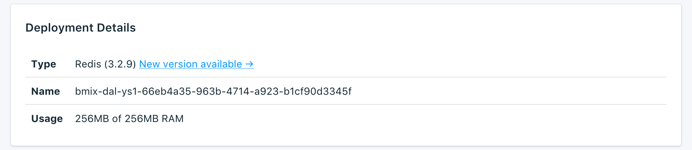

---

Copyright:
  years: 2017,2018
lastupdated: "2018-15-07"
---

{:new_window: target="_blank"}
{:shortdesc: .shortdesc}
{:screen: .screen}
{:codeblock: .codeblock}
{:pre: .pre}

# Service Overview
{: #dashboard-overview}

The _Overview_ page shows you information about your {{site.data.keyword.cloud}} Compose database. The overview includes essential identifying information and current resource usage. You'll also find a section for connection strings that you can use to connect to your database.

## Deployment Details

The _Deployment Details_ panel shows details of your service.

### Type

The type of database that is offered by the service, and the database version that your service uses. If a more recent database version is available, a notification is displayed, and a link to the [Upgrade version](/docs/services/ComposeForRedis?topic=compose-for-redis-dashboard-settings) section of your service dashboard.

### ID

An internal identifier for the service.

### Usage

The size of your database and the amount of storage that is provided by your service plan.

## Recent Tasks

Making administrative changes to your service (such as scaling, or taking a manual backup) starts a task. While the task is running, the _Recent Tasks_ panel shows the task name and a progress bar.

## Connecting

You can connect an external application to your database in two ways. You can either connect by using a **Connection String** or with a **Command Line**. Both are provided on your service dashboard overview.

### HTTPS

The **HTTPS** connection string can be used by some client libraries and contains all the information that is needed for other libraries to connect. You can find out how to use the connection string to connect in [Connecting an external application](/docs/services/ComposeForRedis?topic=compose-for-redis-external-app).

**Note:** If you _un_checked the TLS/SSL-enabled box when the service was provisioned, this connection is **not** TLS/SSL secured. 

### Command Line

The **Command Line** is a preformatted command that invokes `redis-cli` with the correct parameters. To use it, you need to install Redis client tools on the local system. You can find out more about using the command in [Connecting an external application](/docs/services/ComposeForRedis?topic=compose-for-redis-external-app).

## Instance Administration API

You can manage your {{site.data.keyword.composeForRedis}} service through the {{site.data.keyword.cloud_notm}} Compose API.

### Foundation Endpoint

The foundation endpoint is composed of the region the service resides in and the service instance ID. It is at the start of every endpoint.

### Deployment ID

The deployment ID is necessary for most calls, and identifies the specific deployment instance.

### Reference

For more documentation and reference for using the {{site.data.keyword.cloud_notm}} Compose API, across all {{site.data.keyword.cloud_notm}} Compose services, read [The {{site.data.keyword.cloud_notm}} Compose API](https://www.compose.com/articles/the-ibm-cloud-compose-api/).

