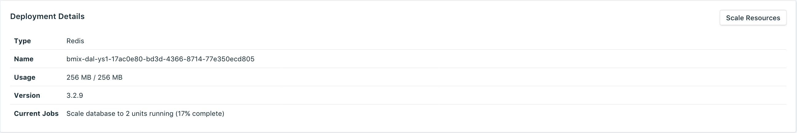

---

Copyright:
  Years: 2017
lastupdated: "2017-09-06"
---

{:new_window: target="_blank"}
{:shortdesc: .shortdesc}
{:screen: .screen}
{:codeblock: .codeblock}
{:pre: .pre}

# Scaling Resources

If your service needs additional memory, or you want to reduce the amount of memory allocated to your service, you can do this by scaling resources.

1. Navigate to your service's dashboard overview page.
2. In the _Deployment Details_ pane, click **Scale Resources**. The Scale Resouces page opens.
    
3. Adjust the slider to raise or lower the memory allocated to the {{site.data.keyword.composeForRedis}} service. Move the slider to the left to reduce the amount of memory, or move it to the right to increase the memory.
4. Click **Scale Deployment** to trigger the rescaling and return to the dashboard overview. The _Deployment Details_ pane contains details of the rescaling job that is now in progress:

    

    When the scaling is complete the _Deployment Details_ pane updates to show the current usage and the new value for the available memory.