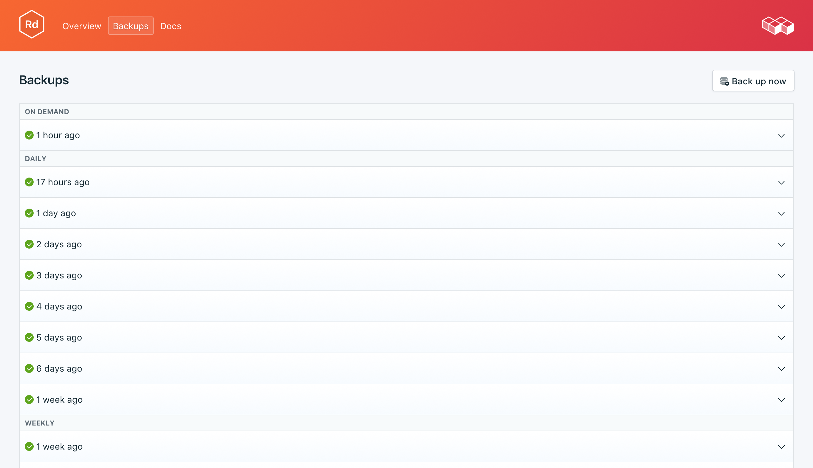

---

copyright:
  years: 2017,2018
lastupdated: "2017-07-13"
---

{:new_window: target="_blank"}
{:shortdesc: .shortdesc}
{:screen: .screen}
{:codeblock: .codeblock}
{:pre: .pre}

# Copias de seguridad
{: #backups}

Puede crear y descargar copias de seguridad desde el separador _Copias de seguridad_ de la página _Gestionar_ del panel de control del servicio. Las copias de seguridad diarias, semanales, mensuales y bajo demanda están disponibles. Se retienen según la siguiente planificación:

Tipo de copia de seguridad|Planificación de retención
----------|-----------
Diario|Las copias de seguridad diarias se retienen durante 7 días
Semanal|Las copias de seguridad semanales se retienen durante 4 semanas
Mensual|Las copias de seguridad mensuales se retienen durante 3 meses
Bajo demanda|Se retiene una copia de seguridad bajo demanda. La copia de seguridad retenida es siempre la copia de seguridad bajo demanda más reciente.
{: caption="Tabla 1. Planificación de retención de copia de seguridad" caption-side="top"}

Las planificaciones de copia de seguridad y las políticas de retención están corregidas. Si necesita mantener más copias de seguridad de las que permite la planificación de retención, debe descargar copias de seguridad y retener archivados según sus necesidades empresariales.

## Visualización de las copias de seguridad existentes

Se planifican automáticamente copias de seguridad diarias de la base de datos. Para ver las copias de seguridad existentes, vaya a la página *Gestionar* del panel de control del servicio. 

Pulse en la fila correspondiente para ampliar las opciones para cualquier copia de seguridad disponible.

 

## Creación de una copia de seguridad a petición

Además de copias de seguridad planificadas, puede crear una copia de seguridad manualmente. Para crear una copia de seguridad manual, vaya a la página *Gestionar* del panel de control del servicio y pulse *Copia de seguridad ahora*.

## Descarga de una copia de seguridad

Para descargar una copia de seguridad, vaya a la página *Gestionar* del panel de control del servicio y pulse *Descargar* en la fila correspondiente a la copia de seguridad que desea descargar.

## Contenido de una copia de seguridad

Redis guarda una instantánea binaria de los datos de forma predeterminada. Se puede utilizar el archivo dump.rdb como copia de seguridad para una recuperación en un punto en el tiempo. Para hacer la instantánea Redis se ramifica, de modo que todo el trabajo correspondiente a la instantánea lo hace el proceso hijo mientras el proceso padre continúa manejando los datos de la forma habilitar. El proceso de copia de seguridad no afecta a la aplicación ni a la base de datos. Puede descargar una copia de las copias de seguridad o restaurarlas directamente en un nuevo despliegue.

## Utilización de una copia de seguridad con una base de datos local

Puede utilizar la copia de seguridad de {{site.data.keyword.composeForRedis}} para ejecutar una copia local de la base de datos.

1. Mueva el archivo dump.rdb a su propio directorio, como por ejemplo 'db'.
2. Necesitaremos un archivo de configuración de Redis para iniciar la instancia de Redis, de modo que necesitará una copia de un archivo redis.conf de la instalación en el directorio db con el archivo dump.rdb. Por ejemplo, si ha instalado Redis en OSX con homebrew, el archivo redis.conf está en `/usr/local/etc`, de modo que desde el directorio db debe ejecutar `cp /usr/local/etc/redis.conf.`
3. Edite el archivo de configuración de modo que apunte al directorio actual cuando se inicie. Abra redis.conf con un editor de texto y cambie la línea `dir /usr/local/var/db/redis/` por `dir .`. Guarde el archivo y salga.
4. Inicie el servidor redis en el directorio bd especificando el archivo de configuración: `redis-server redis.conf`.

## Restauración de una copia de seguridad

Para restaurar una copia de seguridad en una nueva instancia de servicio, siga los pasos para ver las copias de seguridad existentes y luego pulse en la fila correspondiente para ampliar las opciones para la copia de seguridad que desea descargar. Pulse el botón **Restaurar**. Se mostrará un mensaje que le indicará que se ha iniciado una restauración. A la nueva instancia del servicio se le asignará automáticamente el nombre "redis-restore-[timestamp]" y aparecerá en el panel de control cuando comience el suministro.
