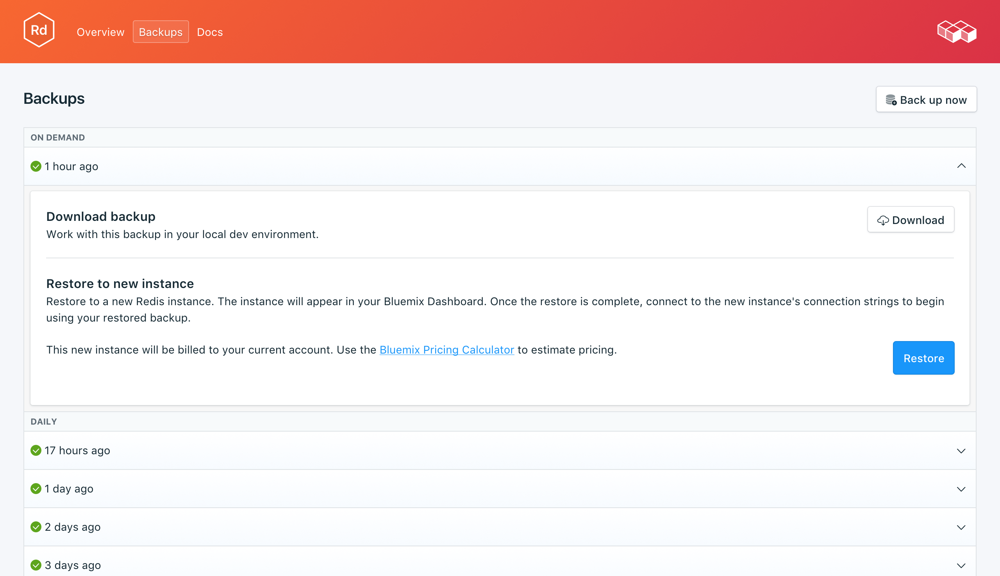

---

copyright:
  years: 2017,2018
lastupdated: "2017-07-13"
---

{:new_window: target="_blank"}
{:shortdesc: .shortdesc}
{:screen: .screen}
{:codeblock: .codeblock}
{:pre: .pre}

# Sauvegardes
{: #backups}

Vous pouvez créer et télécharger des sauvegardes à partir de l'onglet _Backups_ de la page _Gérer_ du tableau de bord de votre service. Vous avez le choix entre les sauvegardes quotidiennes, hebdomadaires, mensuelles et à la demande. Elles sont conservées selon la planification suivante :

Type de sauvegarde|Planification de conservation
----------|-----------
Quotidienne|Les sauvegardes quotidiennes sont conservées pendant 7 jours
Hebdomadaire|Les sauvegardes hebdomadaires sont conservées pendant 4 semaines
Mensuelle|Les sauvegardes mensuelles sont conservées pendant 3 mois
A la demande|Une seule sauvegarde à la demande est conservée. Il s'agit toujours de la dernière sauvegarde à la demande effectuée.
{: caption="Tableau 1. Planification de conservation des sauvegardes" caption-side="top"}

Les planifications de sauvegarde et les règles de conservation sont fixées. Si vous avez besoin de conserver davantage de sauvegardes que ne le permet la planification de conservation, vous devez télécharger les sauvegardes et les archiver en fonction de vos exigences métier.

## Affichage des sauvegardes existantes

Des sauvegardes quotidiennes de votre base de données sont automatiquement planifiées. Pour afficher vos sauvegardes existantes, accédez à la page *Gérer* du tableau de bord de votre service. 

Cliquez sur la ligne correspondante pour développer les options de chaque sauvegarde disponible.

 

## Création d'une sauvegarde à la demande

Outre les sauvegardes planifiées, vous pouvez créer une sauvegarde manuelle. Pour créer une sauvegarde manuelle, accédez à la page *Gérer* du tableau de bord de votre service et cliquez sur *Backup now*.

## Téléchargement d'une sauvegarde

Pour télécharger une sauvegarde, accédez à la page *Gérer* du tableau de bord de votre service et cliquez sur *Télécharger* sur la ligne correspondant à la sauvegarde que vous voulez télécharger.

## Contenu de sauvegarde

Redis sauvegarde par défaut un instantané binaire de vos données. Le fichier dump.rdb peut ensuite être utilisé comme sauvegarde pour une récupération à un point de cohérence. Vous pouvez dévier l'instantané Redis de sorte que l'intégralité du travail lié à l'instantané soit effectué par le processus enfant tandis que le processus parent poursuit le traitement habituel de vos données. Le processus de sauvegarde n'affecte ni votre application ni la base de données. Vous pouvez aussi bien télécharger une copie de vos sauvegardes ou les restaurer directement dans un nouveau déploiement.

## Utilisation d'une sauvegarde avec une base de données locale

Vous pouvez utiliser votre sauvegarde {{site.data.keyword.composeForRedis}} pour exécuter une copie locale de votre base de données.

1. Déplacez le fichier dump.rdb vers un répertoire qui lui est propre, par exemple 'db'.
2. Etant donné que vous aurez besoin d'un fichier de configuration Redis pour démarrer l'instance Redis, il vous faudra copier un fichier redis.conf depuis votre installation dans le répertoire db qui contient déjà le fichier dump.rdb. Par exemple, si vous avez installé Redis sur OSX avec homebrew, le fichier redis.conf se trouve dans `/usr/local/etc` donc, à partir du répertoire db exécutez `cp /usr/local/etc/redis.conf`.
3. Editez le fichier de configuration de sorte qu'il pointe sur le répertoire de travail au démarrage. Ouvrez redis.conf dans un éditeur de texte et modifiez la ligne `dir/usr/local/var/db/redis/` en `dir`. Sauvegardez le fichier et quittez.
4. Démarrez le serveur Redis dans le répertoire db en indiquant le fichier de configuration : `redis-server redis.conf`.

## Restauration d'une sauvegarde

Pour restaurer une sauvegarde sur une nouvelle instance de service, suivez la procédure d'affichage des sauvegardes, puis cliquez sur la ligne correspondante afin de développer les options de la sauvegarde que vous voulez télécharger. Cliquez sur le bouton **Restore**. Un message vous indiquant qu'une restauration a été initiée s'affiche. La nouvelle instance de service sera automatiquement nommée "redis-restore-[timestamp]" ; elle s'affiche dans votre tableau de bord au démarrage de la mise à disposition.
