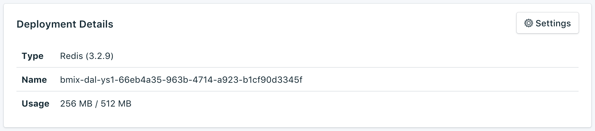

---

Copyright:
  Years: 2017
lastupdated: "2017-09-07"
---

{:new_window: target="_blank"}
{:shortdesc: .shortdesc}
{:screen: .screen}
{:codeblock: .codeblock}
{:pre: .pre}

# Présentation du service

La page _Vue d'ensemble_ affiche des informations concernant la base de données Compose d'{{site.data.keyword.cloud}}. La vue d'ensemble contient des informations d'identification essentielles et indique l'utilisation actuelle des ressources. Vous y trouverez également une section qui contient les chaînes de connexion que vous pouvez utiliser avec les outils pour vous connecter à votre base de données.

## Deployment Details

Le panneau _Deployment Details_ affiche des détails concernant votre déploiement.

### Type

Type de base de données fourni par le service et version de base de données qu'utilise votre service.

### Nom

Identificateur interne du service.

### Utilisation

Taille de votre base de données et quantité de stockage fournie par le plan de service.

## Connexion

Deux moyens permettent de connecter une application externe à votre base de données. Vous pouvez utiliser une **chaîne de connexion** ou une **ligne de commande**. Les deux sont fournies sur la page Vue d'ensemble du tableau de bord de votre service.

### HTTPS

Chaîne de connexion **HTTPS**, qui peut être utilisée par certaines bibliothèques client et qui contient toutes les informations requises pour la connexion d'autres bibliothèques. Pour savoir comment utiliser une chaîne de connexion pour vous connecter, voir [Connexion d'une application externe](./connecting-external.html).

**Avertissement :** A ce stade, cette connexion n'est **PAS** sécurisée SSL/TLS. 

### Ligne de commande

Une **ligne de commande** est une commande préformatée qui appellera `redis-cli` avec les paramètres appropriés. Pour l'utiliser, les outils du client Redis doivent être installés sur le système local. Pour plus d'informations sur la procédure à suivre, voir [Connexion d'une application externe](./connecting-external.html).

**Avertissement :** Cette connexion n'est **PAS** sécurisée SSL/TLS. Redis ne prend pas en charge le chiffrement.

