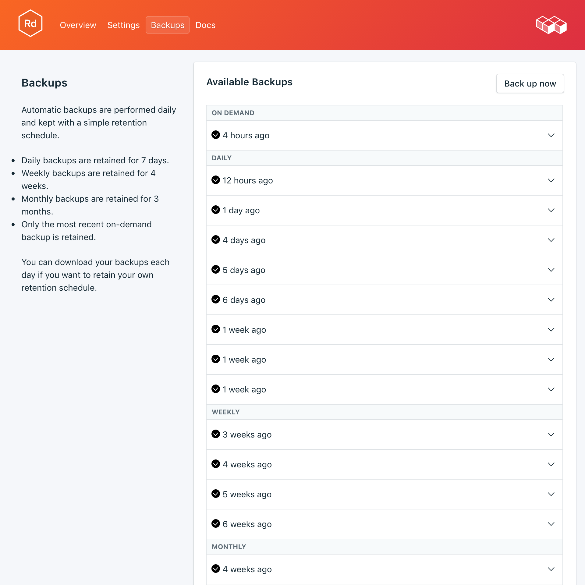

---

copyright:
  years: 2017
lastupdated: "2017-07-13"
---

{:new_window: target="_blank"}
{:shortdesc: .shortdesc}
{:screen: .screen}
{:codeblock: .codeblock}
{:pre: .pre}

# 백업
{: #backups}

서비스 대시보드의 *관리* 페이지에서 백업을 작성하고 다운로드할 수 있습니다. 스케줄된 백업과 수동 백업이 모두 사용 가능합니다.

## 기존 백업 보기

데이터베이스의 일간 백업이 자동으로 스케줄됩니다. 기존 백업을 보려면 서비스 대시보드의 *관리* 페이지로 이동하십시오. 

해당 행을 클릭하여 사용 가능한 백업에 대한 옵션을 펼치십시오.

 

## 요청 시 백업 작성

스케줄된 백업은 물론 수동으로 백업을 작성할 수도 있습니다. 수동 백업을 작성하려면 서비스 대시보드의 *관리* 페이지로 이동하여 *지금 백업*을 클릭하십시오.

## 백업 다운로드

백업을 다운로드하려면 서비스 대시보드의 *관리* 페이지로 이동하여 다운로드할 백업에 해당하는 행에서 *다운로드*를 클릭하십시오. 

## 백업 컨텐츠

Redis는 기본적으로 데이터의 2진 스냅샷을 저장합니다. 그런 다음 dump.rdb 파일을 특정 시점 복구를 위한 백업으로 사용할 수 있습니다. 상위 프로세스에서 계속 데이터를 정상적으로 처리하는 동안 스냅샷에 대한 모든 작업이 하위 프로세스에서 수행될 수 있도록 스냅샷 Redis 분기를 작성합니다. 백업 프로세스는 애플리케이션 또는 데이터베이스에 영향을 미치지 않습니다. 백업의 사본을 다운로드하거나 새 배치에 직접 복원할 수 있습니다.

## 로컬 데이터베이스에 백업 사용

{{site.data.keyword.composeForRedis}} 백업을 사용하여 데이터베이스의 로컬 사본을 실행할 수 있습니다. 

1. dump.rdb 파일을 고유한 디렉토리(즉, 'db')로 이동하십시오.
2. Redis 인스턴스를 시작하기 위한 Redis 구성 파일이 필요하므로 설치에서 dump.rdb 파일이 있는 db 디렉토리로 redis.conf 파일을 복사하려고 합니다. 예를 들어, homebrew를 사용하여 OSX에 Redis를 설치한 경우 redis.conf 파일은 `/usr/local/etc`에 있으므로 db 디렉토리에서 `cp /usr/local/etc/redis.conf`를 실행하십시오.
3. 시작하는 현재 디렉토리를 가리키도록 구성 파일을 편집하십시오. 문서 편집기를 사용하여 redis.conf를 열고 `dir /usr/local/var/db/redis/` 행을 `dir .`로 변경하십시오. 파일을 저장하고 종료하십시오.
4. 구성 파일 `redis-server redis.conf`를 제공하여 db 디렉토리에서 redis 서버를 시작하십시오.

## 백업 복원

백업을 새 서비스 인스턴스에 복원하려면 단계에 따라 기존 백업을 확인한 후 해당 행을 클릭하여 다운로드할 백업에 대한 옵션을 펼치십시오. **복원** 단추를 클릭하십시오. 복원이 시작되었음을 알리는 메시지가 표시됩니다. 새 서비스 인스턴스가 자동으로 "redis-restore-[timestamp]"로 이름 지정되고 프로비저닝이 시작될 때 대시보드에 표시됩니다.
