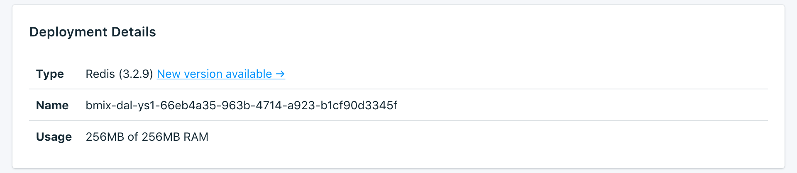

---

Copyright:
  Years: 2017
lastupdated: "2017-09-07"
---

{:new_window: target="_blank"}
{:shortdesc: .shortdesc}
{:screen: .screen}
{:codeblock: .codeblock}
{:pre: .pre}

# 서비스 개요

_개요_ 페이지에는 {{site.data.keyword.cloud}} Compose 데이터베이스에 대한 정보가 표시됩니다. 개요에는 필수 식별 정보와 현재 리소스 사용량이 포함되어 있습니다. 또한 도구와 함께 사용하거나 도구를 활용하여 데이터베이스에 연결할 수 있는 연결 문자열에 대한 섹션도 찾을 수 있습니다.

## 배치 세부사항

_배치 세부사항_ 패널에는 서비스의 세부사항이 표시됩니다.

### 유형

서비스에서 제공하는 데이터베이스의 유형과 서비스에서 사용하는 데이터베이스 버전입니다.

### 이름

서비스의 내부 ID입니다.

### 사용량

서비스 플랜에서 제공되는 데이터베이스의 크기와 스토리지의 양입니다.

## 연결

외부 애플리케이션을 데이터베이스에 연결하는 두 가지 방법이 있습니다. **연결 문자열** 또는 **명령행**을 사용하여 연결할 수 있습니다. 둘 다 서비스 대시보드 개요에서 제공됩니다.

### HTTPS

**HTTPS** 연결 문자열은 일부 클라이언트 라이브러리에서 사용될 수 있으며 다른 라이브러리가 연결하는 데 필요한 모든 정보를 포함합니다. [외부 애플리케이션 연결](./connecting-external.html)에서 연결 문자열을 사용하여 연결하는 방법을 알아볼 수 있습니다.

**참고:** 이때 이 연결은 SSL/TLS로 보안되지 **않습니다**. 

### 명령행

**명령행**은 올바른 매개변수와 함께 `redis-cli`를 호출하는 사전 형식화된 명령입니다. 이를 사용하려면 Redis 클라이언트 도구가 로컬 시스템에 설치되어 있어야 합니다. [외부 애플리케이션 연결](./connecting-external.html)에서 이를 수행하는 방법에 대해 자세히 알아볼 수 있습니다. 

**참고:** 이 연결은 SSL/TLS로 보안되지 **않습니다**. Redis는 암호화를 지원하지 않습니다.

