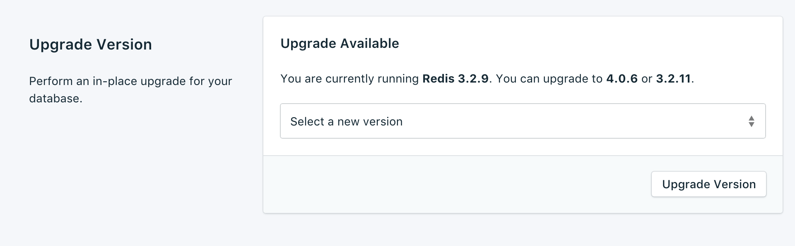
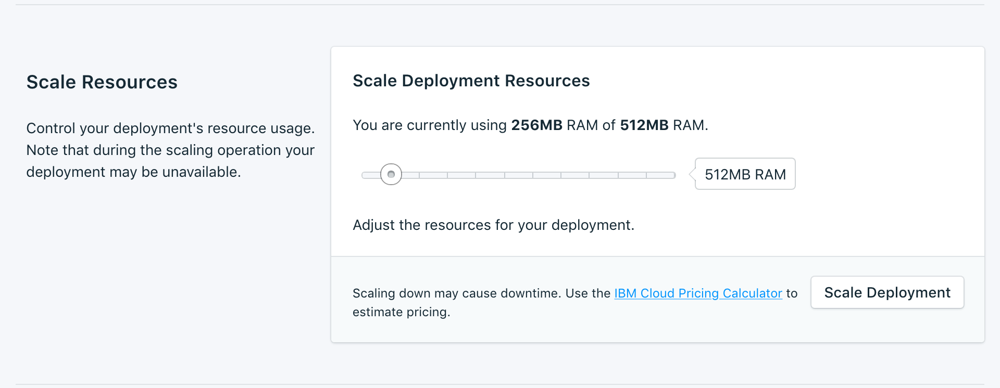
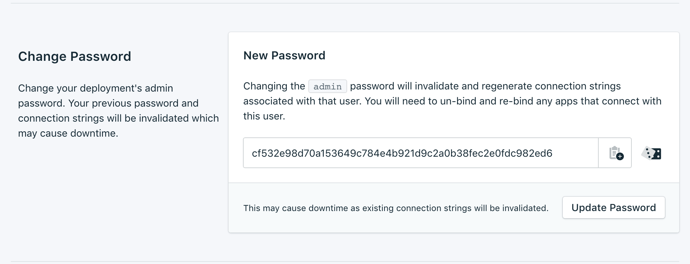

---

Copyright:
  Years: 2017
lastupdated: "2017-10-23"
---

{:new_window: target="_blank"}
{:shortdesc: .shortdesc}
{:screen: .screen}
{:codeblock: .codeblock}
{:pre: .pre}
{:tip: .tip}

# Configurações

Esses recursos permitem que você adapte seu serviço {{site.data.keyword.composeForRedis_full}} para adequar melhor às suas necessidades e requisitos.

## Versão de upgrade

Se houver uma nova versão do banco de dados disponível, um menu suspenso aparecerá, permitindo que você selecione para qual versão gostaria de fazer upgrade. Caso contrário, seu serviço está na versão mais recente disponível e o painel exibe as informações da versão atual.

## Escalando recursos

Se o seu serviço precisa de memória adicional, ou você deseja reduzir a quantia de memória alocada para seu serviço, é possível fazer isso escalando recursos.

1. Navegue para a página de visão geral do painel de seu serviço.
2. Na área de janela _Detalhes da implementação_, clique em **Escalar recursos**. A página Escalar recursos é aberta.
    
3. Ajuste a régua de controle para aumentar ou reduzir a memória alocada para o serviço {{site.data.keyword.composeForRedis}}. Mova a régua de controle para a esquerda para reduzir a quantia de memória ou mova-a para a direita para aumentar a memória.
4. Clique em **Escalar implementação** para acionar o novo ajuste de escala e retorne para a visão geral do painel. A área de janela _Detalhes da implementação_ contém detalhes da tarefa de novo ajuste de escala que está agora em andamento:

    

    Quando o ajuste de escala for concluído, a área de janela _Detalhes da implementação_ será atualizada para mostrar o uso atual e o novo valor para a memória disponível.

## Mudar senha

Você pode achar necessário mudar a senha de seu serviço. É possível fazer isso usando _Atualizar senha_. 

Uma nova senha gerada aleatoriamente aparecerá ou será possível digitar sua própria senha no campo. Para gerar novamente outra senha, clique no cubo à direita do campo. 
  

As mudanças entram em vigor quando você clica no botão **Atualizar senha**. Isso mudará as credenciais que você e seus serviços usam para se conectar e faz parte da sequência de conexões de seu serviço. A área de janela _Detalhes da implementação_ mostrará o progresso da tarefa em execução.

### Atualizando aplicativos conectados

Mudar a senha invalidará a sequência de conexões existente e gerar uma nova. Isso causará uma interrupção de serviço até que aplicativos conectados sejam atualizados com a nova sequência de conexões. Você precisará fazer isso fornecendo a nova sequência de conexões para seus aplicativos.

Mais informações sobre como conectar seus aplicativos estão em [Conectando um aplicativo {{site.data.keyword.cloud}}](./connecting-bluemix-app.html).
e [Conectando um aplicativo externo](./connecting-external.html).

## Usando listas de desbloqueio

Se você deseja restringir o acesso a seus bancos de dados, é possível incluir na lista de desbloqueio endereços IP específicos ou intervalos de endereços IP em seu serviço. Quando não houver endereços IP na lista de desbloqueio, a lista de desbloqueio será desativada e a implementação aceitará conexões de qualquer sistema na Internet.

### Endereços IP
O campo *IP* pode assumir um único endereço IPv4 ou endereço IPv6 completo com ou sem uma máscara de rede. Sem uma máscara de rede, as conexões recebidas devem vir exatamente desse endereço IP. 

Observe que embora a entrada de IP permita IPv6, nenhuma implementação do Compose está atualmente disponível na rede IPv6 e, portanto, esses endereços não podem ser filtrados.

### Máscaras de rede
Para permitir uma conexão de um intervalo especificado de endereços IP, use uma máscara de rede. O endereço IP deve ser totalmente especificado ao usar uma máscara de rede. Isso significa inserir, por exemplo, 192.168.1.0/24 em vez de 192.168.1/24.

### Descrição
A *Descrição* pode ser qualquer texto significativo do usuário para identificar a entrada da lista de desbloqueio - um nome de cliente, identificador de projeto ou número de matrícula, por exemplo. O campo de descrição é obrigatório.

### Serviços do Compose
As entradas da lista de desbloqueio são incluídas automaticamente nos servidores do Compose para permitir que eles se conectem.

### Remoção
Para remover um endereço IP ou máscara de rede da Lista de desbloqueio, clique na entrada *Remover* exibida próxima ele.
Quando todas as entradas na lista de desbloqueio forem removidas, a lista de desbloqueio será desativada e todos os endereços IP serão aceitos pelos portais de acesso TCP.
